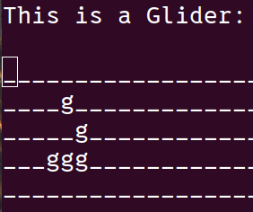

## Simple Game of Life Implementation in C for the terminal.

This is a simple implementation of [Conway's Game of Life](https://en.wikipedia.org/wiki/Conway%27s_Game_of_Life) written in C, that prints a glider to the terminal.

